# Screenshots

Product screenshots of Media Canvas. The [root README](../../README.md) shows a short set; this page has a wider cut. Captures are 3840 × 2160, light theme unless noted.

The full numbered set (light and dark) is in [`v2/`](v2/INDEX.md).

## Visual editor

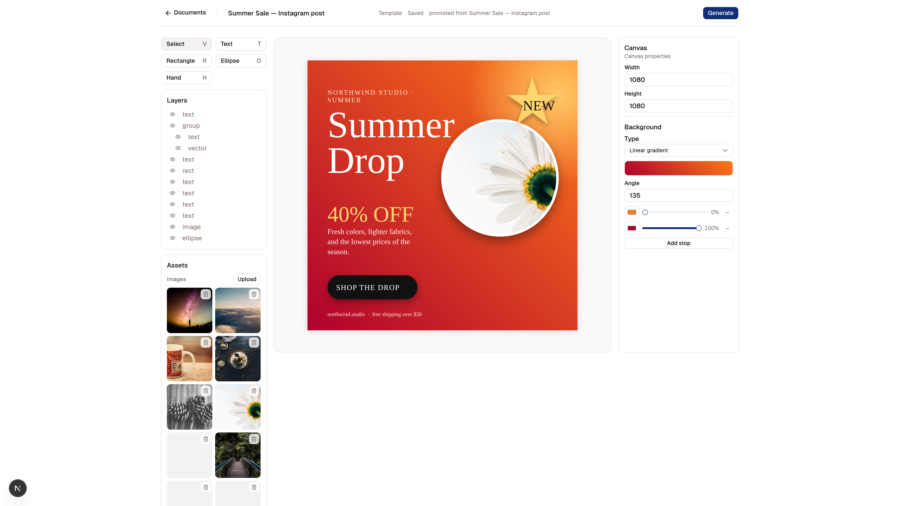

A Template in the visual editor. Layers and image assets sit on the left, canvas properties on the right.

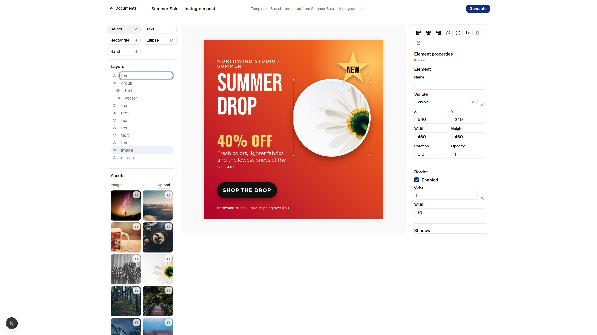

Select an Element to edit it in the inspector.

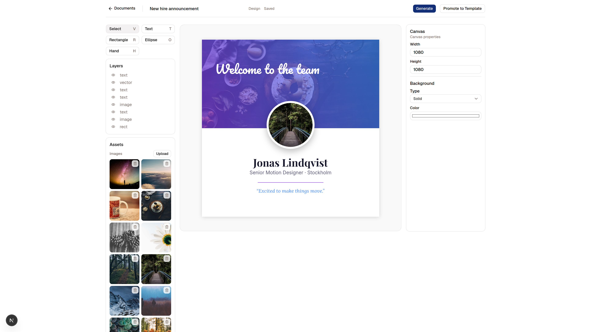

A design before promotion. Generate and Promote to Template are both in the header.

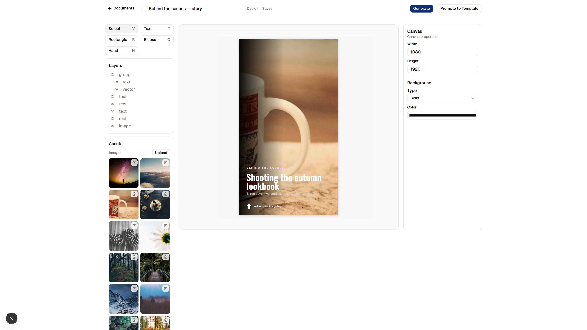

Canvas size is free — this one is a 1080 × 1920 story.

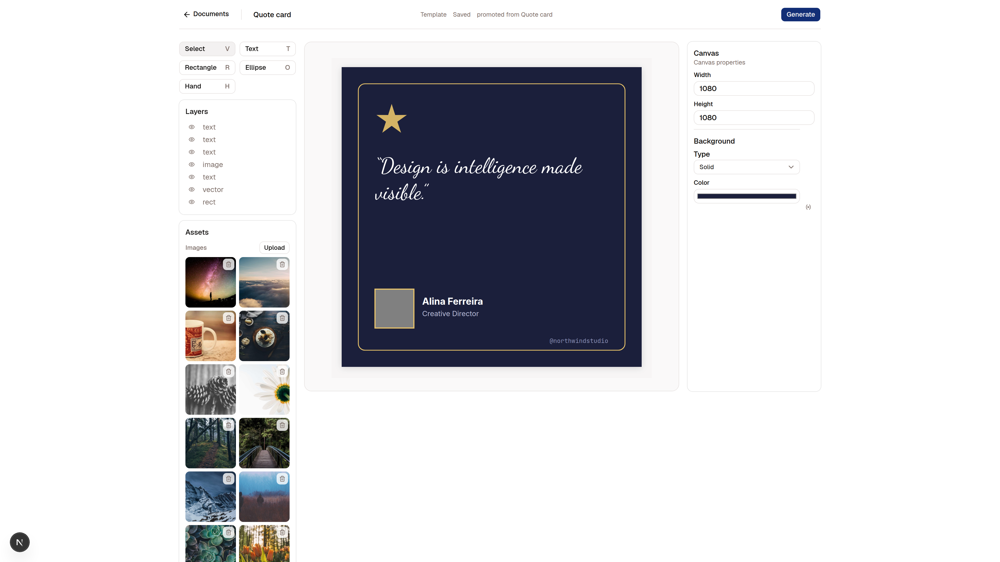

A square quote card Template.

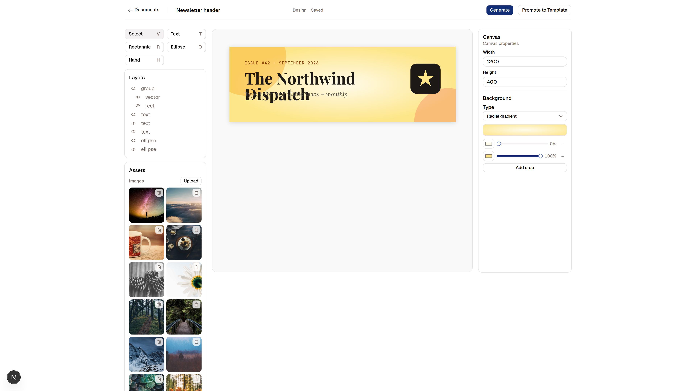

A 1200 × 400 newsletter header. Promote to Template is still available because this file is a design.

## Documents

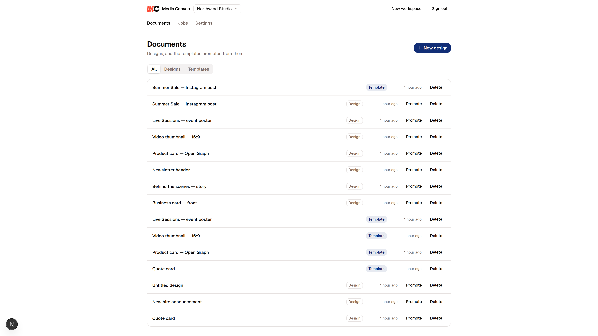

Designs and the Templates promoted from them.

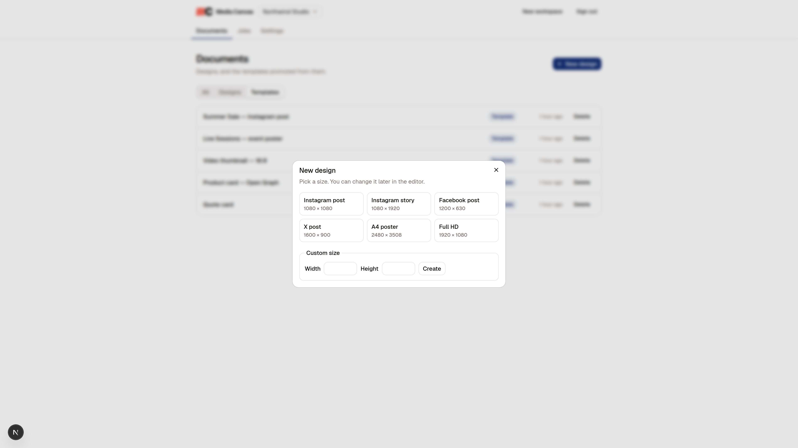

Create a design from a Canvas Preset or a custom size.

## Generation

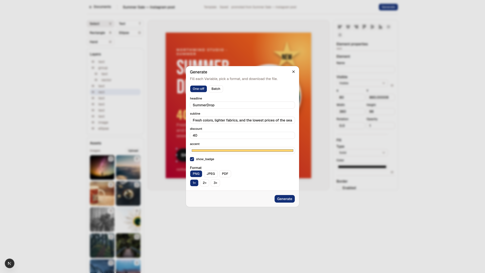

One value per Variable, then PNG, JPEG, or PDF.

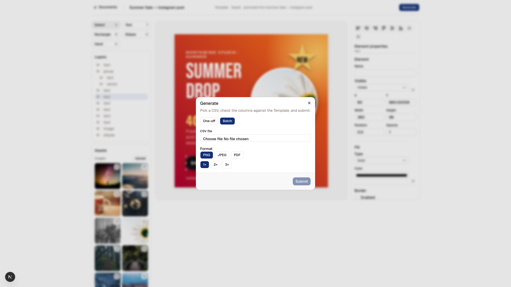

A CSV file becomes one Row per record.

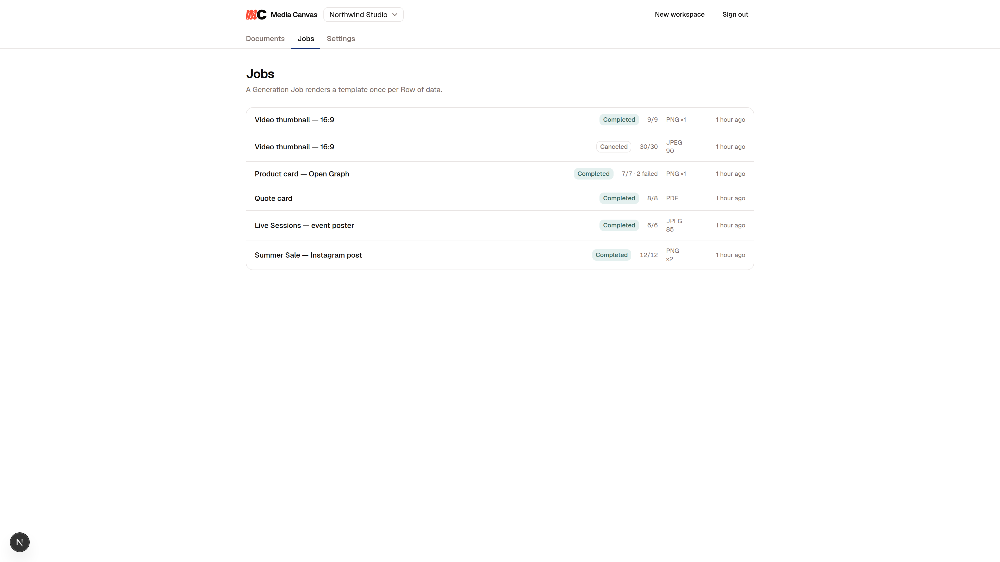

Each Generation Job records format, Row counts, and status.

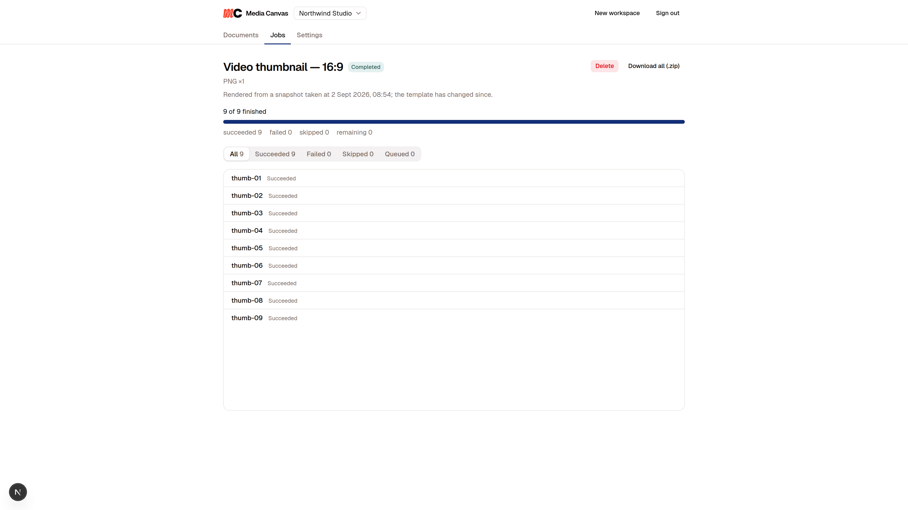

Download an individual asset or the Job archive.

## Dark theme

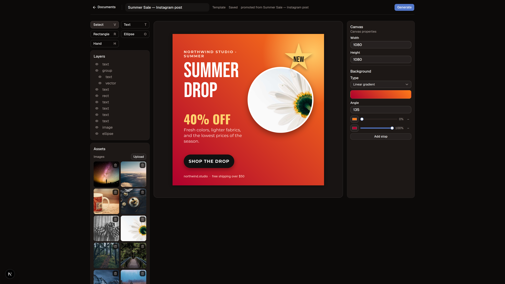
